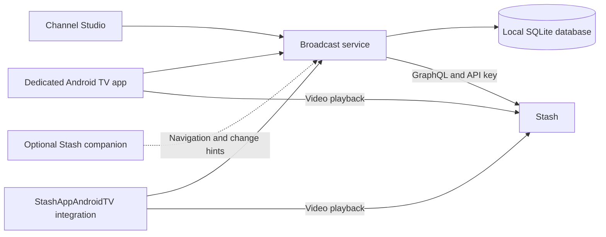

# Greenfield broadcast vision

2026-10-03 · Discussion draft · Owner-proposed working name: **StashTV**.
There is already a [Stash TV plugin](https://github.com/secondfolder/stash-tv)
in the same ecosystem. Keep this as a provisional personal-project name;
public naming and domain availability remain open.

The owner has confirmed shared live TV whose schedule advances while nobody
watches, and an installation designed for their own setup first. Running an
additional service is acceptable. The follow-up also requires general, studio,
performer and owner-created/editable channels; owner-configurable global filters
with a per-channel opt-out; a dedicated Android TV app alongside integration in
StashAppAndroidTV; direct launch into TV mode; whole-video skips that join at a
random-feeling mid-video position; and forward/rewind. Implementation choices
below remain proposals, not a decision to deploy or replace the installation.

**Product promise:** Your library becomes a TV network you can tune into at any
time. You choose what belongs on each channel; the system programs it, keeps it
fresh, and shows what is airing now and next.

**Recommendation:** Build a persistent broadcast service with its own editor
and a small optional Stash companion plugin. Stash owns media, metadata,
permissions and video delivery. The service owns channel definitions, eligible
pools, programming, published airings and operational status. The TV app owns
playback and the viewer's local position.

**What the review established.** This review inspected the plugin runtime,
storage, scheduler, editor, integration contract, Android plugin client and
schedule abstraction, prior audits, and the latest library-survey summary.
Plugin baseline: `1e96af4`. Historical audit findings are design evidence, not
freshly reproduced defects. No tests, benchmarks, live-server queries,
deployments or production inspection were performed for this review.

| Current structure and evidence | Consequence for the rebuild |
| --- | --- |
| `stash-justwatch.yml` invokes a Python raw-interface process; `main.py` reads one envelope and exits. | A persistent service can retain connections, caches and worker state across requests. Process startup is a candidate cost, not a measured bottleneck. |
| `main.py::_lineup_for_channel` calls `lineup.fetch_rotation`, which queries Stash and assembles the rotation during a read. | Prepare playback data ahead of time; tuning and guide reads should use published local data. |
| `programming.py::index_source` and `continuing.py::index_source` independently page channel sources; continuing deduplication is scoped to one prepare run. | Persist shared eligible pools and scene metadata; reuse equal sources across channels and refreshes. Different overlapping sources still need their own membership resolution initially. |
| Definitions, receipts, refresh work, health mirrors, per-channel publications and status live across several JSON files. | Put transactional relationships in one database; keep exports as portable files. |
| Apply journals refresh intent before committing the definition and then drains work inline; an external systemd timer also triggers preparation. | Commit definitions, receipts and work intent together, then let an owned worker process the jobs independently. |
| Legacy catalog/network/library adapters coexist, and custom and network channels have different allowed programming modes and engines. | Use one channel model and one scheduling engine, with origin recorded as provenance. |
| The injected editor uses Stash's React/plugin APIs; `ui/index.js` is approximately 4,100 lines. | Give the editor its own modular application and release lifecycle. Keep Stash integration narrow. File size alone does not establish a performance problem. |
| Android's `BroadcastSchedule` supports both client-computed loops and server publications, with separate caching and fallback behavior. | New clients consume authoritative server airings; keep old behavior behind an explicit compatibility boundary if needed. |

The valuable parts to retain are the behavior contracts: owner-authored content
rules, a single rule projector, stable identities and seeds, explicit Apply,
durable correlated receipts, failure isolation, and changes that invalidate only
the affected channel. A greenfield implementation should use these as acceptance
criteria. It should not inherit every legacy adapter or historical mode name.

**Deployment choices.**

| Choice | Strength | Cost | Fit |
| --- | --- | --- | --- |
| Rebuild as a plugin | Stash installation, authentication and navigation remain familiar. | Background scheduling, persistent caching and transaction coordination still need a deliberate solution. | Viable if plugin-only installation becomes the priority. |
| Independent service | Owns its lifecycle, database, API, editor and background work. | Additional endpoint, service supervision and client authentication. | Best core for the confirmed direction. |
| Service with optional companion | Same core, plus a Stash navigation entry and optional change hints or discovery. | Small additional integration surface to maintain. | Recommended packaging. |

An external process does not automatically become efficient. The gains come from
preparing reusable data, separating reads from work, and simplifying persistence.
Keeping Python in a persistent service could also deliver those gains.

The service initially runs on the same host as Stash, with its own local data
volume and a systemd unit or container. One executable/service and one database
are enough. The process contains separate modules for Stash access, channels,
rules/pools, programming, jobs and the HTTP API. Redis, a separate message broker,
microservices and continuous channel transcoders are outside the initial scope.

The service needs the Stash URL and API key. Stash's
[documented GraphQL API](https://docs.stashapp.cc/api/) supports that connection.
Service authentication is a separate concern: an owner session for the editor
and a paired read credential for TV. Connecting to Stash does not establish who
may edit the service. Initial companion navigation opens the standalone editor;
embedding and single sign-on can be considered later.

**Broadcast behavior comes first.**

- Every channel has one authoritative timeline, independent of connected viewers.
  Two clients resolving the same instant receive the same airing identity and
  interval. No video stream needs to run when nobody is watching.
- Each airing has a stable identity, scene reference, UTC start/end and publication
  generation. Local timezone affects display and any future programming blocks.
  Schedule responses include server time so clients can account for clock skew.
- Default tuning joins the current airing at its elapsed position. Pause, restart
  and skip create a local time shift; completing a shifted airing advances to its
  successor. Returning to live rejoins the shared timeline. Viewer actions never
  consume the channel's broadcast ledger.
- Whole-video next/previous actions retain the owner's preferred mid-video join.
  Forward/rewind move within the selected video, with configurable tap increments
  and accelerating held seeks. Automatic completion after a shifted video moves
  to its successor from the beginning; it does not revisit an earlier live video
  or apply the mid-video skip offset again. Restart and Return to live are explicit
  actions. Exact remote mappings should preserve the current familiar controls.
- Definitions and published playback are distinct. Apply can commit immediately
  while a new pool or schedule is preparing. The UI reports both states truthfully.
- Cosmetic changes leave airings untouched. Proposed content/policy cutover is
  at the next safe airing boundary; the size of the protected future window is
  still open. Missing media and explicit immediate-stop actions need their own
  defined behavior rather than quietly using ordinary edit semantics.
- Distinguish an empty eligible pool from unavailable Stash, failed preparation,
  stale metadata and an expired publication. Readers serve usable published data
  during a preparation outage and use a defined deterministic fallback after the
  horizon expires. A Stash outage may still prevent video delivery.

**One channel and rule model.** A channel has an id, number, group, appearance,
rules, ordering preferences and programming policy. “Custom” and “network” are
origins, not different playback types. Existing imported ids, seeds, authored
rules and exclusions remain intact. A wider number range is possible later;
existing number bands are preserved on import until deliberately changed.

**Channel families.** General channels match owner-authored themes and content
rules. Studio channels can target one studio, its descendants or an authored
studio group. Performer channels can target one performer or an authored group.
Owner-created channels can combine these rules freely. All families can be named,
numbered, branded, grouped and edited; the family is a useful creation template,
not a different engine or a restriction on later rule edits.

Offer suggested studio/performer channels and optional automatic generation with
owner-configured eligibility thresholds. Thousands of entities should not
automatically become thousands of channels. Suggestions report playable counts
after the effective rules; those counts must not be confused with Stash's
total-library entity-activity predicates. Generated channels need stable identities
and an explicit policy for later template changes, so refresh cannot overwrite
owner edits. Automatic generation and its update behavior are recommendations,
not yet owner-selected requirements.

Keep rules readable: tags, studios and performers with explicit ANY/ALL,
exclusions, date, duration, recency and text; support dynamic entity predicates
when the connected Stash schema supports them. Use one canonical representation
and one Stash projector across validation, preview and pool preparation. Preserve
the distinction between total-library entity counts and counts after channel
exclusions. A cached preview should identify the pool generation and freshness
it describes. A fresh draft preview may query Stash; normal TV reads should not.

**Global filters with per-channel opt-out.** This is an explicit greenfield
requirement and changes the previous product's policy for owner-authored channels.
It must be designed into rule evaluation, previews and scheduling together.

Proposed initial model: one owner-managed global rule set and a real boolean
`useGlobalFilters` on each channel. New channels inherit by default; the owner can
disable inheritance on any channel. Channel rules always apply. Effective
membership is `channelRules AND globalRules` when inheritance is enabled, and
`channelRules` when disabled. A global rule never widens a channel's own pool.
Its AND composition must preserve nested ANY/ALL and exclusions exactly.

The editor shows whether inheritance is enabled, the global rules that apply,
the effective rule summary, and before/after playable counts on demand. Validation,
draft previews, pool preparation and every client use the same server-resolved
definition. Global filtering is shared broadcast policy, not a per-TV setting.

A global-filter edit creates one new global revision and durably queues all
inheriting channels. Bypassing channels do not rebuild because of that edit.
Pool identity incorporates the canonical effective rules and their dynamic
dependencies. New workers cannot publish against an obsolete global revision.
The change has visible pending/ready status and a defined publication cutover.
Exclusion edits also need read-time gating of incompatible future publications
and clearing of stale client pages; the currently playing airing's treatment is
an explicit product decision. Keep a deliberate immediate-stop action separate
from ordinary safe-boundary updates.

On import, preserve the existing effective membership. Proposed migration mapping
is to bypass newly introduced global rules for imported channels until the owner
explicitly chooses inheritance, optionally in a reviewed bulk operation. Opt-out
does not remove exclusions already authored inside the channel. Granular per-rule
global overrides and multiple filter profiles can follow if the simple switch
proves insufficient.

**Dedicated Android TV experience.** Ship a separate app in addition to the
StashAppAndroidTV integration. After initial setup/pairing, opening it tunes TV
directly. Proposed startup choices are last channel, a chosen channel, a favorite
or a random eligible channel, joining live by default. Device-boot autostart is
a separate optional requirement; launching the app straight into playback does
not imply taking over the TV's launcher.

The app presents the player first, with guide, favorites, channel number entry,
search and settings available through remote-friendly overlays. Playback keeps
whole-video surfing distinct from seeking, exposes live/time-shift status, and
offers Return to live. Pairing and endpoint changes should be practical without
typing API keys with the remote. Video access still needs authenticated Stash
delivery; the service's read credential alone is not a Stash playback credential.

Recommended implementation direction is native Kotlin with Media3 playback.
Explore a small reusable Kotlin module for the service client, playback state,
airing navigation and remote behavior, usable from both Android apps. Keep app
navigation and dependency injection outside it. This requires an integration
design in the existing app, not copying its large ViewModel into a new APK.
Behavioral parity should be tested against the same airing scenarios in both apps.

Measure actual time to first frame and seek responsiveness on dev Fire TV
hardware. API response time alone does not establish fast channel changes.
Prepare nearby guide/airing metadata, and benchmark bounded media preloading at
the expected join position without competing with the active stream. Media3
provides [preloading support](https://developer.android.com/media/media3/exoplayer/preloading-media/preloadmanager);
select the strategy only after verifying the media formats, seek positions,
device memory and bandwidth involved. Prefetching whole channels is unnecessary.

**Additional features worth prioritizing.** Favorites, hidden channels and startup
preferences make the dial manageable. Dynamic channel suggestions and minimum
pool thresholds reduce maintenance. Fresh-arrival priority and repeat controls
keep large libraries interesting, with honest thin-pool warnings. Rule explanations
and filter previews make programming predictable. Clear preparation/failure status,
portable channel exports and consistent backups make the service operable.

Keep favorites, recently visited channels and temporary hides local to the viewer
unless explicitly synchronized; owner edits and content filters remain shared.
Candidate later features include previewing live TV in the browser, named
programming blocks, saved filter presets and an explicit scheduled premiere.
They should not delay a reliable core for authoring and watching channels.

The first programming policy should be understandable: work through the eligible
pool before repeating, preserve broadcast history across ordinary edits, and
avoid consecutive repeats whenever another eligible scene exists. Introduce
new-arrival weighting, cooldowns, spacing and timed blocks individually, with
explicit tradeoffs for small pools. A looping rotation can be a policy within
the same engine. Defer reproducing every current scheduling knob.

**Storage and worker design.** Use SQLite for definitions, revision history,
idempotent receipts, job intent, shared scene metadata, pool memberships,
publications and broadcast accounting. A short Apply transaction commits the
definition change, receipt and required work together. Remote validation occurs
outside that transaction, followed by revision checks inside it. Identical
requests replay their stored result before needing Stash again.

Workers claim durable jobs with leases, compute outside write transactions, and
publish only if the definition/pool generation still matches. Retry with bounded
backoff and fair scheduling. Keep receipt outcome separate from mutable job
progress. A stale worker cannot replace a newer publication. Separate completed
broadcast history from future reservations so reconstruction cannot consume an
airing twice. This is a bounded broadcast ledger, not an event-sourcing framework.

For concurrent reads and background writes, WAL is a candidate SQLite mode;
keep the database on a local filesystem and use short write transactions.
[SQLite's WAL documentation](https://www.sqlite.org/wal.html) explains concurrent
read/write behavior and its same-host requirement. Database backups must use a
consistent backup mechanism rather than copying a live main file alone.

**Efficiency strategy.** Persist eligible scene-id sets keyed by canonical
source, resolved saved-filter content and dynamic evaluation epoch. Separate
membership from ordering so equal sources with different shuffle seeds can share
query results. Store reusable scene metadata once. Initially, Stash remains the
membership authority: do not build an independent replica of its filter semantics.

A bounded reconciliation worker refreshes pools and metadata. Optional Stash hooks
provide change hints to accelerate this, but recovery must work without them.
Track indirect dependencies such as tag/studio hierarchy changes, saved-filter
edits and performer/studio activity thresholds. When the affected set is uncertain,
invalidate the relevant rule class broadly and rebuild within a fair work budget.
Define and expose the maximum acceptable staleness rather than promising instant
membership updates without an event feed.

Serve guide rows in a batch, retrieve only the visible guide window, and index
airings by channel and time. Keep tuning independent of pool refresh. Bound
query concurrency to avoid overloading Stash. Measure before considering a full
metadata mirror or local rule evaluator: those add synchronization and semantic
maintenance costs, even though the existing survey shows they are feasible.

**Proposed acceptance targets, not measured claims.** Use a reproducible fixture
of 500 channels, 25,000 scenes, overlapping/distinct pools, empty channels and
several simultaneous clients. The recorded September survey had about 21,000
scenes; this is historical sizing evidence, not a current production measurement.

| Check | Initial target |
| --- | --- |
| Warm directory and tune-resolution API requests | LAN p95 below 100 ms, excluding video startup |
| Batch guide for 20 channels over a two-hour window | LAN p95 below 200 ms |
| Prepared TV directory, guide and tune requests | No synchronous membership queries to Stash |
| Cosmetic edit | No membership fetches and no airing changes |
| Source edit | Only dependent pools/channels rebuilt; unrelated playback stays usable |
| Restart or worker failure | Published data remains readable; unfinished jobs recover |
| Broadcast correctness | Same instant gives the same airing across clients; no duplicate accounting on retries/restarts |

Measure cold and warm response times, Stash requests, first-ready time,
reconciliation latency, CPU, peak memory, disk growth and long-outage recovery.
Set build-time and resource budgets from the first realistic benchmark. Backend
language stays provisional until that experiment; Go is a packaging candidate,
and a persistent Python backend remains a credible option. TypeScript/React is a
reasonable editor choice given the existing UI, with modules and a normal build.

**Build sequence.** First agree on the product behavior and API boundary. Then
prove a small end-to-end slice on dev: connect to Stash, create one channel,
persist its pool, publish airings, and tune it from two clients. Exercise restart,
missed refresh and Stash failure before scaling to the 500-channel fixture.

Next build the focused Channel Studio editor, reusable rules, batch guide and
diagnostics around that core. Then add a reviewed importer and TV integration.
Implement advanced programming only once the base engine is demonstrably correct
and its resource costs are known.

Use a separate greenfield project and separate data directory once the working
name and direction are selected. The current plugin remains the reference and
migration source. Import actual authoritative deployment data, never silently
replace it with a compiled artifact or a proposal. The later 234-channel survey
proposal and the older 513-network seed are distinct; neither becomes an automatic
replacement catalog. Report unsupported rules, verify membership/identity parity,
and preserve exclusions exactly. Schedule/history preservation and cutover need a
separate migration design. Changing a brand name alone must not change identity.

The first new TV integration should consume the service directly behind a
separate backend adapter. An old-protocol bridge is optional if existing APKs
need support; do not impose all legacy behavior on the new core. Validate the
new system on dev and retain the existing installation until an explicit cutover.

**Open product decisions:** final name; exact remote mappings and mid-video join
distribution; startup channel policy;
how long announced future airings remain protected; treatment of the current airing
when an exclusion changes; how quickly library changes must become eligible;
automatic studio/performer channel generation; and whether named daily/weekly
programming blocks are useful after the core channel families are established.

Primary integration references checked for this review: Stash
[external plugin interfaces](https://docs.stashapp.cc/in-app-manual/plugins/externalplugins/),
[plugin hooks](https://docs.stashapp.cc/in-app-manual/plugins/), and
[UI plugin API](https://docs.stashapp.cc/in-app-manual/plugins/uipluginapi/).
The UI API is documented as experimental; a standalone editor reduces the scope
of the application that depends on it.
